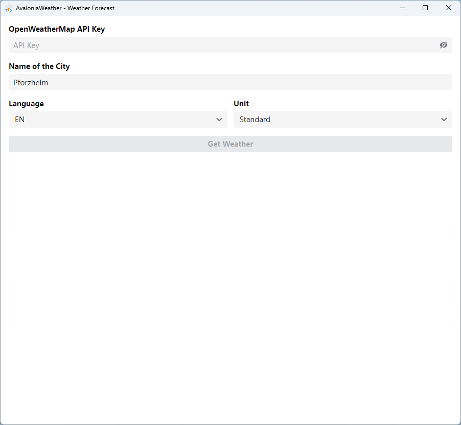
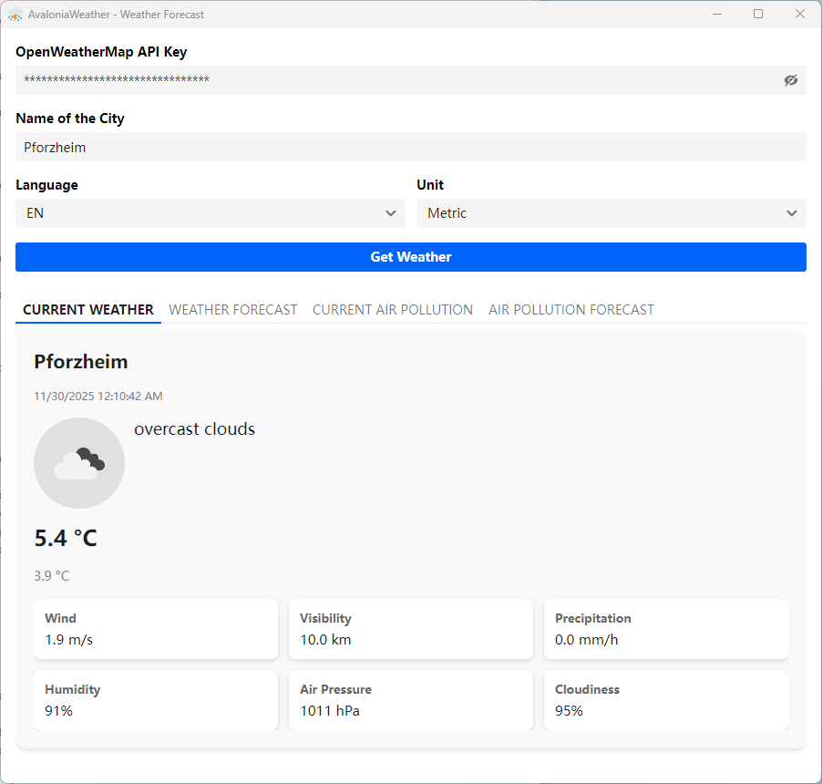
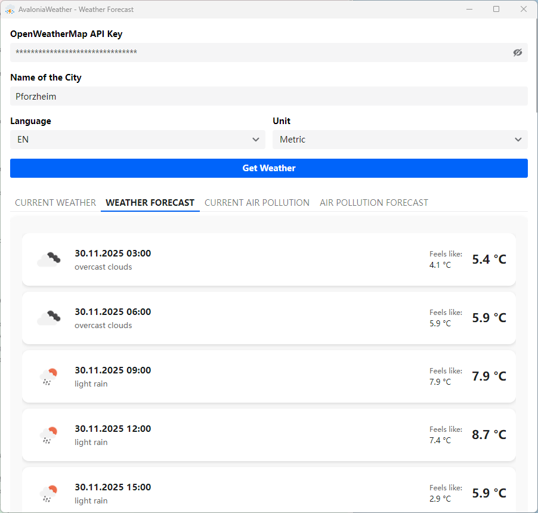
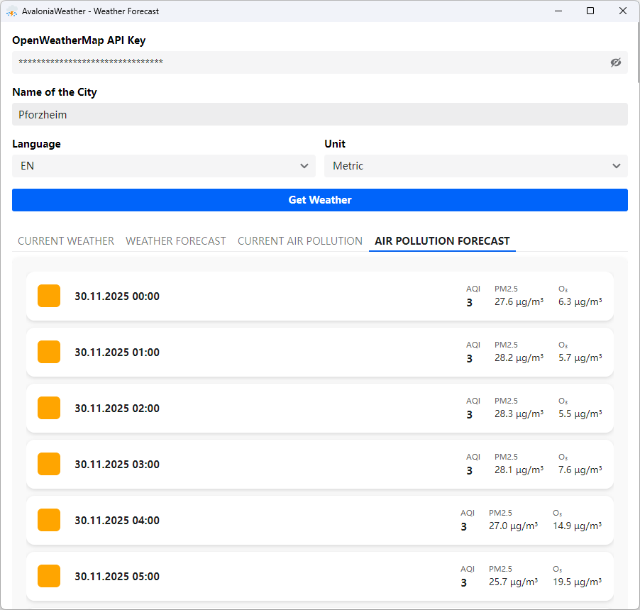

# 🌦️ AvaloniaWeather

Cross-platform, modern, and extensible weather & air quality desktop app built with Avalonia UI and .NET.


Targets `.NET 10` , leveraging MVVM, localization, fluent styling, and clean service abstractions.

## 🧭 Overview

AvaloniaWeather is a desktop application that displays current weather, 5‑day forecast (3‑hour intervals), and air quality (current + forecast) using the OpenWeatherMap API. It is designed to be:

- **Cross-platform:** Runs on Windows, macOS, and Linux (Avalonia).
- **Extensible:** Service layer abstractions make alternative providers easy to plug in.
- **Responsive & Fluent:** Uses Semi theme + Inter font.
- **Localized:** Multi-language weather data and UI resource strings.

## ✨ Features

- Current weather (temperature, conditions, humidity, wind, etc.)
- 5-day / 3-hour interval forecast aggregation
- Current air pollution (AQI + component metrics)
- Air pollution forecast entries
- Unit selection (Standard / Metric / Imperial)
- Language selection (all `LanguageCode` values supported by OpenWeatherMap)
- Manual API key input with validation feedback
- MVVM via `CommunityToolkit.Mvvm` (source generators for commands & observable properties)
- Rich value converters (e.g. unit suffix, formatting, AQI → color brush)
- Fluent styling & central style definitions (`Styles/AppDefaultStyles.axaml`)
- Resource-based localization using `.resx` (English + German samples)

## 🏗️ Architecture

Logical layers:

| Layer | Purpose |
|-------|---------|
| Views (`Views/*`, `.axaml`) | XAML UI composition (Avalonia) |
| ViewModels (`ViewModels/*`) | State + commands (MVVM, toolkit generators) |
| Services (`Services/*`) | External API orchestration & domain assembly |
| Interfaces (`Services/Interfaces/*`) | Abstractions for service factories/providers |
| Models (`Models/*`) | App-level result composition (e.g. `WeatherResult`) |
| Converters (`Converters/*`) | UI value transformations |
| Resources (`Strings/*`) | Localized strings (.resx) |
| Styles (`Styles/*`) | Theming & shared brushes/fonts |

Data flow (simplified):

```text
User Input (API Key / City / Unit / Language)
  ↓
MainWindowViewModel.GetWeatherAsync()
  ↓ (Factory)
WeatherService (parallel OpenWeatherMap calls)
  ↓
WeatherResult (aggregate DTO)
  ↓
ViewModel properties → Bindings → Views → Converters → Render
```

## 🛠️ Tech Stack

- **Runtime:** .NET 10 compatible (`global.json` pins 10.0.100)
- **UI:** Avalonia ([`Avalonia.Desktop`](https://www.nuget.org/packages/Avalonia.Desktop))
- **MVVM & Source Generators:** [`CommunityToolkit.Mvvm`](https://www.nuget.org/packages/CommunityToolkit.Mvvm)
- **Weather & Air Data:** [`OpenWeatherMapSharp`](https://www.nuget.org/packages/OpenWeatherMapSharp)
- **Styling & Components:** [`Semi.Avalonia`](https://www.nuget.org/packages/Semi.Avalonia), [`AsyncImageLoader.Avalonia`](https://www.nuget.org/packages/AsyncImageLoader.Avalonia)
- **DI (optional expansion):** [`Microsoft.Extensions.DependencyInjection`](https://www.nuget.org/packages/Microsoft.Extensions.DependencyInjection)
- **Localization:** `.resx` resources (public code generator)

## 🚀 Getting Started

### Prerequisites

- .NET SDK 10.0.100 — install from [official .NET downloads](https://dotnet.microsoft.com/en-us/download/dotnet/10.0).
- OpenWeatherMap account + API key: [OpenWeatherMap API](https://openweathermap.org/api)

### Clone & Restore

```bash
git clone https://github.com/tsjdev-apps/weather-avalonia.git
cd weather-avalonia/src/AvaloniaWeather
dotnet restore
```

### Build

```bash
dotnet build -c Release -f net10.0
```

### Run

```bash
dotnet run -f net10.0
```

If you encounter SDK mismatch errors, verify the installed version matches `global.json`.

### Multi-target (optional)

You can build against net9.0 if supported by your environment:

```bash
dotnet build -f net9.0
```

## 🔑 Configuration (API Key)

The application does not persist your API key by default; it is entered directly into the UI (`MainWindowViewModel.ApiKey`). Obtain a key from OpenWeatherMap and paste it before fetching data. Future enhancements may add secure storage or encrypted persistence.

Validation ensures the key is non-empty before enabling the fetch command.

## 🌐 Localization

UI strings live in `Strings/Resources.resx` (default) and `Strings/Resources.de-DE.resx` (German). OpenWeatherMap language selection happens separately via the `SelectedLanguage` property, allowing both UI & data localization.

To add a new UI language:

1. Duplicate `Resources.resx` → `Resources.<culture>.resx`.
2. Add translations.
3. Rebuild (designer generates `Resources.Designer.cs`).

## 📸 Screenshots







## 🤝 Contributing

Contributions are welcome! Please:

1. Fork the repository.
2. Create a feature branch (`feature/<short-description>`).
3. Ensure builds pass (`dotnet build`).
4. Open a PR with a concise description & motivation.

For larger proposals, consider opening an issue first for discussion.

## 📄 License

This project is licensed under the MIT License. See `LICENSE` for details.

## 🙏 Acknowledgments

- OpenWeatherMap API & data
- Avalonia UI team & ecosystem packages
- CommunityToolkit team for MVVM toolkit
- Semi.Avalonia for additional UI components

---

Enjoy exploring AvaloniaWeather! Feedback & feature ideas are appreciated.
